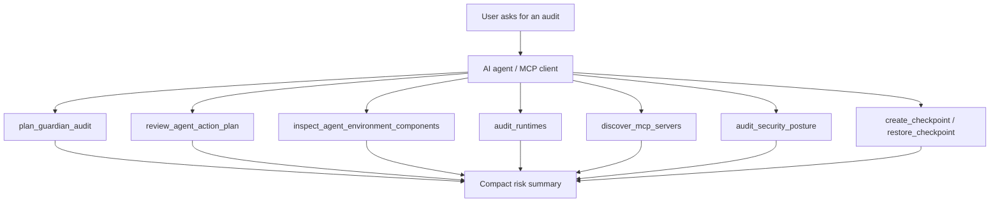

# AgentOps Guardian Architecture

AgentOps Guardian is a local-first MCP toolkit for developers who use AI coding
agents. It is designed to run only when requested, return compact findings, and
avoid spending tokens on repeated broad scans.

## Product Frame

Problem: AI coding-agent workspaces quickly become hard to reason about. A user
may have multiple MCP servers, plugins, model providers, hooks, local tools, and
project-specific rules active at the same time. That creates safety, debugging,
and reproducibility issues.

Solution: provide deterministic, read-only-first tools that inspect the local
agent environment and create safe restore points before risky edits.

## Core Flow

## Economy Mode

AgentOps should not behave like a monitoring daemon. Its default behavior is:

- manual invocation only;
- bounded roots, not whole-machine scanning;
- compact summaries before verbose details;
- deterministic parsing before model reasoning;
- explicit file writes only for checkpoint/restore or requested normalization.

## Agent Layer

The agent layer is intentionally small:

- `plan_guardian_audit` selects a bounded sequence of checks for the user's
  stated goal.
- `review_agent_action_plan` checks proposed edits or shell commands before
  execution and tells the agent whether a checkpoint or explicit approval is
  needed.

This satisfies the agentic workflow requirement without making AgentOps a
background daemon or a generic memory assistant.

## Inspector Integration

The new `inspect_agent_environment_components` MCP tool wraps the existing
Python inspector in read-only JSON mode. By default it strips verbose
remediation instructions to reduce token use. Users can request full guidance
with `includeInstructions: true`.

This preserves the mature scanner without rewriting it prematurely. A TypeScript
port is a future cleanup task if Python becomes a deployment burden.

## Capstone Concepts

## Backup-First Tool Surface

The visible workflow starts with `guardian_run_workflow`, which performs the capstone agent loop in one call:

1. Plan a bounded audit.
2. Inspect the local agent/MCP surface lazily.
3. Score and triage compact findings.
4. Review the proposed action.
5. Create checkpoints for target files.
6. Persist compact workflow state.
7. Return a compact decision and clear next action.

The direct recovery tools stay close to the surface:

1. `prepare_safe_edit` reviews the proposed agent action and checkpoints every target file.
2. `safe_checkpoint` is the direct low-friction backup button.
3. `restore_latest` is the direct rollback button.
4. `guardian_restore_workflow` restores every file checkpointed by a saved workflow id.

Lower-level `create_checkpoint` and `restore_checkpoint` remain available for integrations that need exact session IDs or checkpoint IDs.

## Agentic Economy

The Guardian agent does not run continuously. It plans when asked, inspects lazily, scores compact findings, and asks for explicit action before expensive or risky work. Inspector calls use a short in-memory cache by default and support fresh scans through `useCache`/`cacheTtlMs`. `guardian_run_workflow` stores a small JSON state file under `.agentops/workflows` so the agent can resume a task without maintaining a verbose conversation memory.

- MCP Server: AgentOps exposes local tools through MCP.
- Agent Skills: backup, environment inspection, component inspection, safety
  review.
- Security: dangerous scripts, risky agent instructions, active model/MCP/plugin
  components.
- Deployability: local-first Node server, no cloud dependency.
